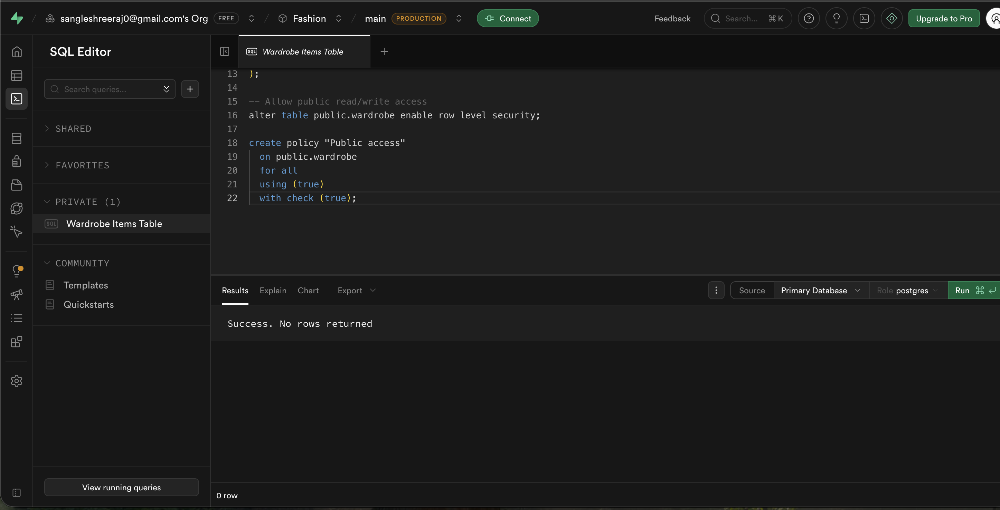

# StyleMate — AI Outfit Helper 👔👗

**StyleMate** is your personal AI-powered fashion stylist, specifically designed for the unpredictable weather of Dublin, Ireland. 



## 🚀 Overview

Never wonder "What should I wear today?" again. StyleMate takes the guesswork out of your morning routine by analyzing:
1.  **Your Wardrobe**: High-quality digital representation of your actual clothes.
2.  **Live Weather**: Real-time temperature and conditions from Dublin (via Open-Meteo API).
3.  **The Occasion**: Whether it's a date night, a business meeting, or a gym session.
4.  **AI Intelligence**: Claude 3.5 Sonnet (via OpenRouter) suggests 3 distinct, stylistically sound outfit combinations from your items.

## ✨ Key Features

- **Smart Outfit Picker**: Select your occasion and get instant AI-curated recommendations.
- **Weather-Aware Logic**: AI automatically suggests layers if it's raining or below 15°C in Dublin.
- **Wardrobe Manager**: Easily add new items with photo uploads to your personal database.
- **Luxury UI**: A dark-themed, polished interface using Playfair Display and DM Sans for a premium feel.
- **Skin Tone Matching**: Tailors suggestions based on your personal profile.

## 🛠️ Tech Stack

- **Frontend**: React + Vite (TypeScript)
- **Styling**: Tailwind CSS + Framer Motion (Animations)
- **Database**: Supabase (PostgreSQL + Storage for images)
- **AI**: OpenRouter API (Anthropic Claude 3.5 Sonnet)
- **Weather**: Open-Meteo API
- **Package Manager**: pnpm (Monorepo)

## ⚙️ Local Setup

1.  **Clone the repository**:
    ```bash
    git clone https://github.com/ShreerajSangle/Style_Mate.git
    cd Style_Mate
    ```

2.  **Install dependencies**:
    ```bash
    pnpm install
    ```

3.  **Set up Environment Variables**:
    Create a `.env` file in `artifacts/stylemate/` with:
    ```env
    VITE_SUPABASE_URL=your_supabase_url
    VITE_SUPABASE_ANON_KEY=your_supabase_key
    VITE_OPENROUTER_API_KEY=your_openrouter_key
    ```

4.  **Run the application**:
    ```bash
    pnpm --filter @workspace/stylemate run dev
    ```
    The app will be available at `http://localhost:3001`.

## 📜 License

MIT License. Developed by Shreeraj Sangle.
